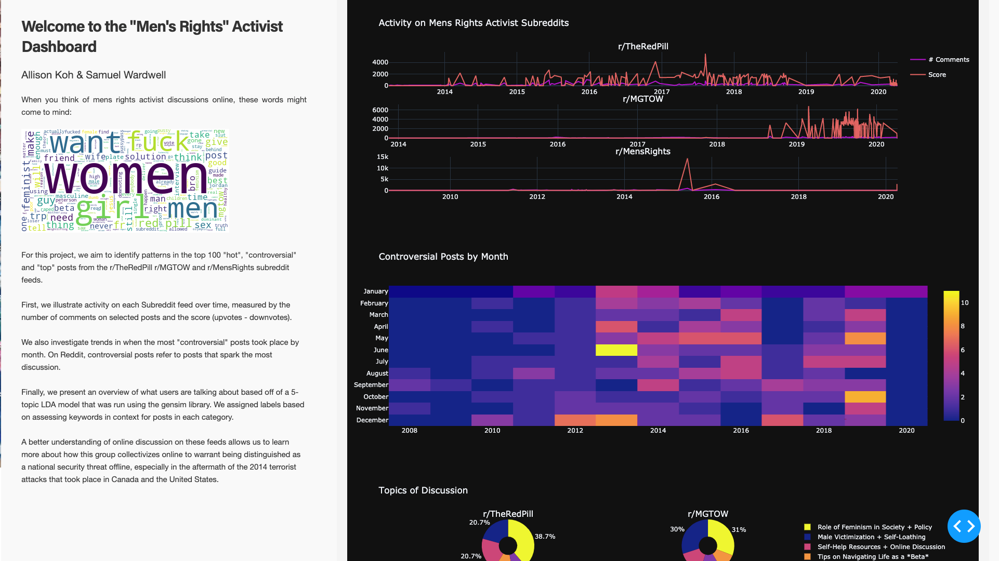

# dash-reddit-trp

## About this app

This dashboard allows you to explore a preliminary analysis of content from three Men's Rights Activist Reddit feeds: `r/TheRedPill`, `r/MGTOW` and `r/MensRights`. As the first two subreddits are quarantined, this app offers an avenue for anyone interested to learn more about the content of these feeds without directly interacting wiht the content itself.

## Requirements

* Python 3

## How to run this app

We suggest you to create a virtual environment for running this app with Python 3. Clone this repository
and open your terminal/command prompt in the root folder.

```
git clone https://github.com/allisonkoh/dash-reddit-trp
cd dash-app
python3 -m virtualenv venv
```
In Unix system:
```
source venv/bin/activate

```
In Windows:

```
venv\Scripts\activate
```

Install all required packages by running:
```
pip install -r requirements.txt
```

Run this app locally with:
```
python app.py
```

## Screenshot


